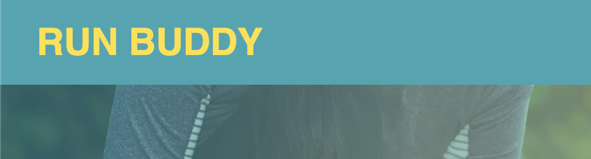

# starter-portfolio

## Started off by git cloning my repository to my local terminal
Opened vs code via terminal to start creating process
## Create webpage
Created an html and built the basic code to open a website
created and linked a css sheet to the html to edit html website
## Reason for website
starter-portfolio is a website created to give to professional web developers to look at my progress and creations as a web developer

## Navigation Configuration
Putting "About Me" "Work" and "Contact Me" on the top right for easy navigation
Inputting photos that have links attached to them for easy navigation for users

## Contact links
Input various ways to contact me on the very bottom so it is clear to see for visitors
Added "id" to link the header words to the specific link on the page ie: about me, my work, and contact me

## Images
 

## Screen sizing
Setup media query for the page to be responsive for various screens and devices. Will just set is for "All"

## Website
https://robertschris44.github.io/starter-portfolio/